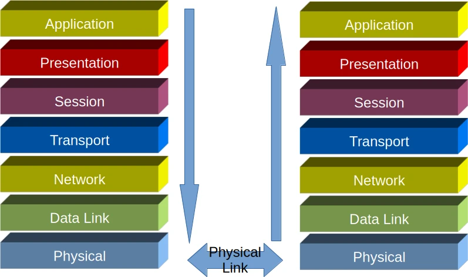
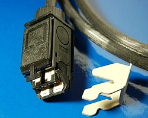
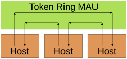
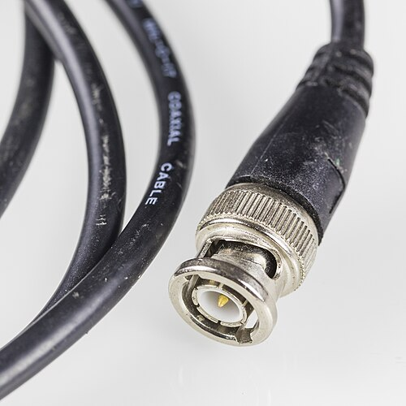
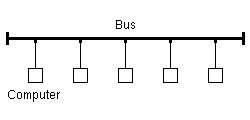
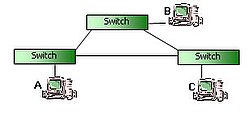
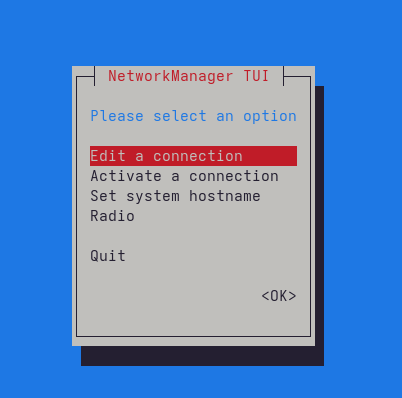
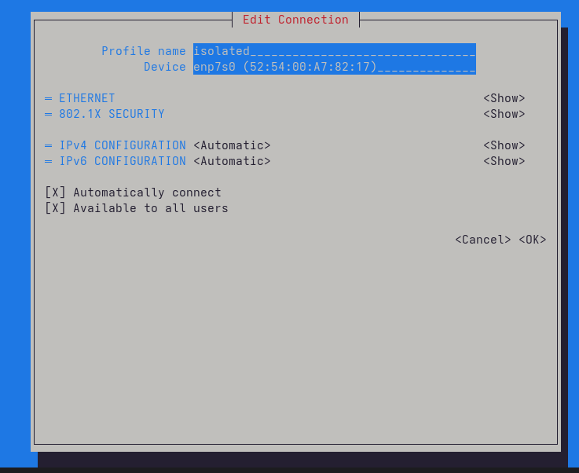
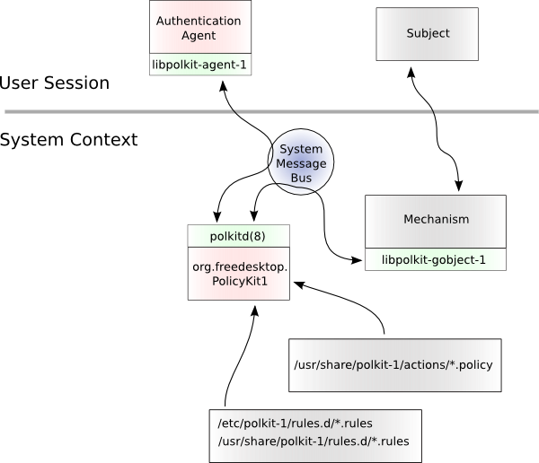
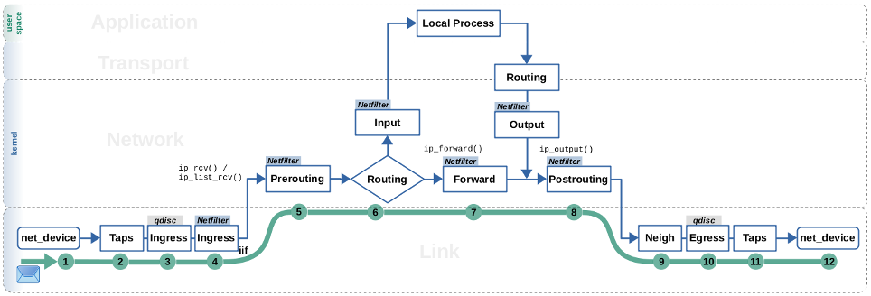

<style>
section {
  font-size: 28px;
}
h1 {
  font-size: 1.6em;
}
h2 {
  font-size: 1.3em;
  padding-bottom: 0.1em;
  border-bottom: 2px solid rgba(255, 255, 255, 0.3);
  margin-bottom: 0.8em;
}
li {
  font-size: 0.95em;
}
/* Code blocks - default for CLI/code examples */
pre {
  background-color: transparent;
  padding: 0.5em 0;
  margin: 0.5em 0;
  font-family: monospace;
}
pre code {
  color: #ffffff !important;
}
/* ASCII diagrams - centered with scale */
section.ascii pre {
  margin: 2em auto 1em auto;
  width: fit-content;
  transform: scale(2);
  transform-origin: center center;
}
section.ascii pre code {
  font-size: inherit;
}
.centered-slide {
   display: flex;
   flex-direction: column;
   justify-content: center; /* Centers content vertically */
   text-align: center;      /* Centers text horizontally */
}

</style>

<!-- _paginate: false -->
<!-- _header: "" -->
<!-- _class: lead -->
<style scoped>
section {
  background-image: 
    linear-gradient(to bottom, rgba(0, 0, 0, 0.7), rgba(0, 0, 0, 0.8)),
    url(images/intlug-banner.png);
  background-size: cover;
  background-position: center;
}
h1 {
  color: #FFD700;
  text-shadow: 2px 2px 4px rgba(0, 0, 0, 0.9);
  font-size: 2.5em;
}
h2 {
  color: #FFFF00;
  text-shadow: 2px 2px 4px rgba(0, 0, 0, 0.9);
  font-size: 1.8em;
}
p, li, em, strong {
  color: #FFFFFF;
  text-shadow: 1px 1px 3px rgba(0, 0, 0, 0.9);
}
a {
  color: #00FFFF;
  text-shadow: 1px 1px 3px rgba(0, 0, 0, 0.9);
}
</style>

# Welcome to INTLUG!
## International Linux Users Group

January 3rd, 2026

We meet **every first Saturday** of the month - 10AM EST

**Join Us:**
- 📅 Events & Chat: https://heylo.group/international-linux-users-group
- 📧 Mailing List: https://lists.firemountain.net/mailman/listinfo/intlug

*Monthly agenda, discussions, and resources available on Heylo*

---
<!-- _class: lead invert -->

# Linux Networking Fundamentals

---

<style scoped>
.columns {
  display: grid;
  grid-template-columns: 700px 1fr;
  gap: 2em;
}
.columns > .right {
  border-left: 1px solid #ccc;
  padding-left: 1rem;
  text-align: center;
}
</style>

## Why Networking Matters

<div class="columns">
<div>

**Every Linux admin needs networking skills:**
- Servers don't serve without a network
- Troubleshooting often starts with "Can you ping it?"
- Security relies on understanding network layers
- Cloud, containers, VMs - it's all networking underneath

</div>
<div>


</div>
</div>

**Today's Goal:**
Simplify Linux networking concepts! This is an intro session - **ask questions anytime.**

---

<style scoped>
.columns {
  display: grid;
  grid-template-columns: 1fr 1fr;
  gap: 2em;
}
.columns > .right {
  border-left: 1px solid #ccc;
  padding-left: 1rem;
}
</style>

## Agenda

<div class="columns">
<div>

1. **Networking Foundations**
   - IPv4 Addressing & Subnetting
   - The OSI Model in Linux Context
   
2. **Network Configuration on Fedora**
   - NetworkManager (CLI & GUI)
   - Legacy vs Modern Approaches
   
3. **Essential Networking Tools**
   - Interface Management
   - Routing & Troubleshooting
   - Performance Monitoring

</div>
<div class="right">

4. **Firewall Management**
   - firewalld Basics
   - Zone Configuration
   - Service & Port Management

5. **Advanced Topics**
   - Dual-Homed Systems
   - NAT & Routing
   - Proxy Servers
   - Service Configuration (DNS, DHCP, Web Servers)

</div>
</div>

---

<!-- _class: lead invert -->

# Part 1: Networking Foundations

---
<!-- _header: 'Linux Networking | Networking Foundations '-->

## Questions We'll Answer

- How do messages go from one computer to another?
- Why was "Internet" - as a collection of networks - such a big step forward by ARPA?
- What does "Ethernet" mean, and why did "Token Ring" and other standards lose?
- What's the difference between a switch and a router? Why aren't we using HUBs anymore?
- What constitutes a local network?

---

<style scoped>
.columns {
  display: flex;
  gap: 2%;
  align-items: center;
}
.columns > div:first-child {
  flex: 60%;
}
.columns > div:last-child {
  flex: 38%;
}
</style>

<!-- _header: 'Linux Networking | Networking Foundations '-->

## The OSI Model & TCP/IP Stack

<div class="columns">
<div>



</div>
<div>

**Key concepts:**
- **Encapsulation**: Each layer adds its header
- **OSI is theoretical**, TCP/IP is what we actually use
- **Linux works at Layers 2-7** (we'll focus on 2 & 3 today)

</div>
</div>

---

<!-- _header: 'Linux Networking | Networking Foundations '-->

## TCP/IP Stack & OSI Model Mapping

```
OSI Layer              TCP/IP Layer
---------              ------------
7. Application  ]
6. Presentation ] ---> Application (HTTP, SSH, DNS)
5. Session      ]

4. Transport    -----> Transport (TCP, UDP)

3. Network      -----> Internet (IP, ICMP)

2. Data Link    ]
1. Physical     ] ---> Link (Ethernet, WiFi)
```

---
<!-- _header: 'Linux Networking | Networking Foundations '-->

## How Messages Go From Computer to Computer

- **Layer 2 (Local)**: Ethernet frames use MAC addresses
  - Same subnet: Direct via switch | Switch learns MACs, forwards intelligently

- **Layer 3 (Remote)**: IP packets use IP addresses
  - Different subnets: Through router/gateway | Router changes frame, preserves IP

- **Socket Pair**: To send/recieve messages, you need MAC and PORT on both sides. 
IP allows routing (layer 3).

- **Encapsulation**: Application → TCP/UDP → IP → Ethernet
  - Each layer adds header with addressing info

- **Journey**: App → OS stack → NIC → Wire → Switch/Router → Destination

---

<!-- _header: 'Linux Networking | Networking Foundations '-->

## Why "Internet" Was Revolutionary

- **Before Internet**: Isolated networks with proprietary protocols
  - IBM SNA, DECnet, Novell IPX couldn't interoperate

- **ARPA's Innovation**: Network of networks with TCP/IP universal language
  - Routers connect different networks | Packet switching (vs circuit switching)

- **Scalability**: Decentralized, no single control point
  - Any network joins if it speaks TCP/IP | 4 nodes (1969) → billions today

- **Impact**: Global connectivity enabling information sharing
  - Foundation for web, email, modern internet

---

<!-- _header: 'Linux Networking | Networking Foundations '-->
<!-- _footer: 'January 2026 - https://github.com/intlug/networking.git - All image-sources from Wikipedia (commons)' -->

## Ethernet: The Winner of LAN Standards

- **What is Ethernet?** IEEE 802.3 LAN standard
  - CSMA/CD (Carrier Sense Multiple Access/Collision Detection)
  - Evolved: Coaxial → twisted pair → fiber

- **Why Ethernet Won:** Simplicity + Cost + Speed + Flexibility
  - No complex token passing | Cheaper NICs/switches | Easy scaling (10Mb→100Gb)

- **Why Token Ring Lost:** Expensive MAUs (hub/switch) | Complex mechanism | Hard to troubleshoot | IBM proprietary vs open Ethernet

- **Modern Ethernet**: Switched (not shared), full duplex, no collisions

   |  

---

<!-- _header: 'Linux Networking | Networking Foundations '-->

## Switches vs Routers (and Why HUBs Died)

- **HUB (L1)**: Broadcasts to all ports, shared bandwidth → **Dead** (inefficient, 1990s)

- **Switch (L2)**: Learns MACs, forwards to specific port only
  - Full duplex, wire speed | Same network/subnet

- **Router (L3)**: Routes between different networks/subnets
  - IP-based, routing tables | Internet gateway

- **Key**: Switch = same network | Router = different networks

---

<!-- _header: 'Linux Networking | Networking Foundations '-->

## What Constitutes a Local Network?

- **Technical**: Devices in same subnet (e.g., 192.168.1.0/24)
  - Same network prefix | Direct communication (no router) | Same broadcast domain

- **Physical**: Connected to same switch(es), Layer 2 connectivity
  - All devices see each other's broadcasts

- **Boundaries**: Subnet mask defines range
  - 192.168.1.0/24 = .1 to .254 | Outside range = "remote"

- **Why it matters**: Routing decisions | Performance | Security | Firewall rules

---

<!-- _header: 'Linux Networking | Networking Foundations '-->

## IPv4 Addressing Basics

**Why IPv4?** Despite IPv6 existing since 1998, IPv4 still runs most networks.

**Structure**: Four octets (0-255): `192.168.1.100`

**Key Components:**
- **IP Address**: Unique device identifier (phone number for computers)
- **Subnet Mask**: Network vs host portion (who's local)
- **Gateway**: Router to reach other networks (escape route)
- **DNS**: Translates hostnames to IPs (humans ≠ numbers)

---

<!-- _class: invert ascii -->
<!-- _header: 'Linux Networking | Networking Foundations '-->

<style scoped>
section.ascii pre {
  margin: 4em auto 3.5em auto;
}
</style>

## Ethernet Frame & IP Packet Structure

```
┌──────────────────────────────────────────────────────────────┐
│              ETHERNET FRAME (Layer 2)                        │
├──────────────┬──────────────┬────────────┬───────────────────┤
│ Dest MAC     │  Src MAC     │ EtherType  │   Payload         │
│ (6 bytes)    │  (6 bytes)   │ (2 bytes)  │   (46-1500)       │
│11:22:33:44:55│aa:bb:cc:dd:ee│   0x0800   │                   │
└──────────────┴──────────────┴────────────┴───────────────────┘
                                            │
                 ┌──────────────────────────┘
                 │
      ┌──────────▼───────────────────────────────────────────┐
      │       IP PACKET (Layer 3)                            │
      ├──────────┬─────────────┬─────────────┬───────────────┤
      │ Header   │   Src IP    │   Dst IP    │  Payload      │
      │(20 bytes)│  (4 bytes)  │  (4 bytes)  │  (variable)   │
      │          │192.168.1.10 │192.168.1.20 │               │
      │          │             │             │               │
      └──────────┴─────────────┴─────────────┴───────────────┘
```
**Layer 2 (Ethernet)**: MAC addresses (local) | **Layer 3 (IP)**: IP addresses (end-to-end)  
**MAC changes hop-by-hop** | **IP stays constant** | **Both headers in every packet**

---
<!-- _class: ascii invert -->
<!-- _header: 'Linux Networking | Networking Foundations '-->

<style scoped>
section.ascii pre {
  margin: 2em auto 3.5em auto;
}
</style>

## Layer 2: Same Subnet Communication

```
┌────────────────────────────────────────────────────┐
│      192.168.1.0/24 Network (Switch)               │
│                                                    │
│  Host A                           Host B           │
│  IP:  192.168.1.10                192.168.1.20     │
│  MAC: aa:bb:cc:dd:ee:ff           11:22:33:44:55   │
│                                                    │
│       ←─────── Ethernet Frame ────────→            │
│   [SRC MAC: aa:bb] [DST MAC: 11:22] [DATA]         │
└────────────────────────────────────────────────────┘
```

Subnet defined as /24 (255.255.255.0) on both hosts

**Same subnet = Direct communication** | ARP resolves IP→MAC | Switch uses MACs | **No router**

---
<!-- _class: ascii invert -->
<!-- _header: 'Linux Networking | Networking Foundations '-->

<style scoped>
section.ascii pre {
  margin: 1em auto 1em auto;
}
</style>

## Layer 3: Routing Between Subnets

```
┌─────────────┐          ┌──────────┐          ┌─────────────┐
│   Host A    │          │  Router  │          │   Host B    │
│ 192.168.1.10│─────────→│          │─────────→│  10.0.0.5   │
│ MAC: aa:bb  │          │eth0  eth1│          │ MAC: 99:88  │
└─────────────┘          └──────────┘          └─────────────┘
 192.168.1.0/24       MAC: 77:66  88:77         10.0.0.0/24
```

**Step 1: Host A → Router**
```
Ethernet: SRC MAC: aa:bb (Host A)  →  DST MAC: 77:66 (Router eth0)
IP:       SRC IP:  192.168.1.10    →  DST IP:  10.0.0.5
```

**Step 2: Router → Host B**
```
Ethernet: SRC MAC: 88:77 (Router eth1)  →  DST MAC: 99:88 (Host B)
IP:       SRC IP:  192.168.1.10         →  DST IP:  10.0.0.5
```

**MAC changes each hop** (Layer 2) | **IP stays constant** (Layer 3)

---
<!-- _class: ascii invert -->
<!-- _header: 'Linux Networking | Networking Foundations '-->

<style scoped>
section.ascii pre {
  margin: 2.5em auto 3em auto;
}
</style>

## How Hosts Know: Local vs Remote?

**The subnet mask decides:**

```
Host A: 192.168.1.10/24  wants to reach  192.168.1.20
  ↓
192.168.1.10  AND  255.255.255.0  =  192.168.1.0  (my network)
192.168.1.20  AND  255.255.255.0  =  192.168.1.0  (same!)
  ↓
  Decision: SAME SUBNET → Send directly via ARP

Host A: 192.168.1.10/24  wants to reach  10.0.0.5  
  ↓
192.168.1.10  AND  255.255.255.0  =  192.168.1.0  (my network)
10.0.0.5      AND  255.255.255.0  =  10.0.0.0     (different!)
  ↓
  Decision: DIFFERENT SUBNET → Send to gateway (router)
```

**Subnet mask = The decision maker** for local vs remote traffic

---
<!-- _class: ascii invert -->
<!-- _header: 'Linux Networking | Networking Foundations '-->

<style scoped>
section.ascii pre {
  margin: 2em auto 2em auto;
}
</style>

## Subnet Mask Impact

**Same network, different masks:**

```bash
# /24 = 254 hosts
$ ipcalc 10.0.0.0/24
Network: 10.0.0.0/24  |  HostMin: 10.0.0.1  |  HostMax: 10.0.0.254
Broadcast: 10.0.0.255  |  Hosts/Net: 254

# /16 = 65,534 hosts  
$ ipcalc 10.0.0.0/16
Network: 10.0.0.0/16  |  HostMin: 10.0.0.1  |  HostMax: 10.0.255.254
Broadcast: 10.0.255.255  |  Hosts/Net: 65534
```

**Smaller prefix = larger network** | /16 gives 256× more IPs than /24

---

<!-- _header: 'Linux Networking | Networking Foundations '-->

## The OSI Model &#x2192; Linux Networking

| Layer | Name | Linux Components | Purpose |
|-------|------|------------------|---------|
| 7 | Application | curl, ssh, nginx | User applications |
| 4 | Transport | TCP/UDP sockets | End-to-end connections |
| 3 | Network | IP routing, iptables | Routing between networks |
| 2 | Data Link | Ethernet, bridges | Local network communication |
| 1 | Physical | NIC drivers, cables | Physical transmission |

*Linux primarily works at layers 2-7*

---
<!-- _class: lead invert -->

# Part 2: Network Configuration

---

<!-- _header: 'Linux Networking | Network Configuration '-->

## NetworkManager: The Modern Approach

**Why NetworkManager?**
- D-Bus based architecture for modern IPC
- Dynamic configuration (changes apply instantly)
- Integrated with systemd and PolKit
- Supports WiFi, VPN, bridges, bonds and more

**Advantages over legacy methods:**
- No manual `/etc/sysconfig/network-scripts/` editing
- Automatic connection management
- Desktop environment integration

---
<!-- _class: invert code -->
<!-- _header: 'Linux Networking | Network Configuration '-->

## nmcli: NetworkManager Command Line

**View connections and status:**
```bash
nmcli connection show
nmcli device status
nmcli device show eth0
ip addr show eth0
```

**Create a new connection:**
```bash
nmcli connection add con-name "MyConnection" type ethernet \
    ifname eth0 ipv4.addresses 192.168.1.100/24 \
    ipv4.gateway 192.168.1.1 ipv4.dns "8.8.8.8" ipv4.method manual

nmcli connection add con-name "MyDHCP" type ethernet ifname eth0
```

---
<!-- _class: invert code -->
<!-- _header: 'Linux Networking | Network Configuration '-->

## nmcli: Managing Connections

```bash
# Activate/deactivate
nmcli connection up MyConnection
nmcli connection down MyConnection

# Modify existing connection
nmcli connection modify MyConnection ipv4.addresses 192.168.1.150/24

# Delete connection
nmcli connection delete MyConnection

# Create connection from (unused) device
nmcli device connect eth1
```

---
<!-- _header: 'Linux Networking | Network Configuration '-->
<style scoped>
.columns {
  display: grid;
  grid-template-columns: 1fr 1fr;
  gap: 2em;
}
.columns > .right {
  border-left: 1px solid #ccc;
  padding-left: 1rem
}
</style>

## GUI Network Configuration

<div class="columns">
<div>

**GNOME Settings:**
- Settings → Network → Gear icon for advanced options

**nmtui (Text UI):**

An simpler too than `nmcli` is `nmtui`

- Terminal-based interface
- Good for remote systems
- Simpler than nmcli commands
</div>
<div class="right">




</div>


---
<!-- _header: 'Linux Networking | Network Configuration' -->

## PolKit & Network Permissions
<style scoped>
.columns {
  display: grid;
  grid-template-columns: 1fr 1fr;
  gap: 2em;
}
.columns > .right {
  border-left: 1px solid #ccc;
  padding-left: 1rem
}
section p { font-size: 0.8em }
</style>

<div class="columns">
<div>

**PolKit** controls access to privileged commands

```bash
# Check permissions
pkaction | grep -i network

# Common actions:
# org.freedesktop.NetworkManager.network-control
# org.freedesktop.NetworkManager.settings.modify.system
```
`/etc/polkit-1/rules.d` hold custom policies, ie. giving access to features without the need of sudo. Use `pkexec` to run commands through polkit (instead of sudo).

This is how the GUI allows you to change network parameters without root access.

</div>
<div>



</div>
</div>

---
<!-- _class: invert lead -->
<!-- _header: 'Linux Networking | Network Configuration' -->

# Part 3: Essential Networking Tools

---
<!-- _header: 'Linux Networking | Essential Networking Tools' -->
<style scoped>
.columns {
  display: grid;
  grid-template-columns: 1fr 1fr;
  gap: 2em;
}
.columns > .right {
  border-left: 1px solid #ccc;
  padding-left: 1rem
}
</style>

## Interface Management Commands

<div class="columns">
<div>

**View interfaces:**
```bash
ip link show                # All interfaces
ip addr show                # With IP addresses
nmcli device status         # NetworkManager view
```
**Bring interface up/down:**
```bash
sudo ip link set eth0 up
sudo ip link set eth0 down
```
</div>
<div class="right">

**Temporary IP assignment:**

```bash
sudo ip addr add 192.168.1.100/24 dev eth0
sudo ip addr del 192.168.1.100/24 dev eth0
```
</div>

---
<!-- _header: 'Linux Networking | Essential Networking Tools '-->

## Routing Commands

**View routing table:**
```bash
ip route show
route -n                    # Legacy command
netstat -rn                 # Legacy command
```

**Add/delete routes:**
```bash
# Add route to network via gateway
sudo ip route add 10.0.0.0/8 via 192.168.1.1

# Add default gateway
sudo ip route add default via 192.168.1.1

# Delete route
sudo ip route del 10.0.0.0/8
```

---
<!-- _header: 'Linux Networking | Essential Networking Tools '-->
<style scoped>
.columns {
  display: grid;
  grid-template-columns: 1fr 1fr;
  gap: 2em;
}
.columns > .right {
  border-left: 1px solid #ccc;
  padding-left: 1rem
}
</style>

## Network Troubleshooting Tools

<div class="columns">
<div>

**Connectivity testing:**
```bash
ping -c 4 8.8.8.8           # Test connectivity
ping -c 4 google.com        # Test DNS resolution
traceroute google.com       # Trace packet path
mtr google.com              # Combined ping/traceroute
```
</div>
<div class="right">

**DNS troubleshooting:**
```bash
nslookup google.com
dig google.com
host google.com
```

**View DNS configuration:**
```bash
cat /etc/resolv.conf
resolvectl status
```
</div>
</div>

---
<!-- _header: 'Linux Networking | Essential Networking Tools '-->

## Network Statistics & Monitoring

**Connection information:**
```bash
ss -tuln                    # Listening TCP/UDP ports
ss -tupn                    # Established connections
netstat -tuln               # Legacy alternative
```

**Network statistics:**
```bash
ip -s link                  # Interface statistics
ifstat                      # Bandwidth monitoring
nload                       # Real-time bandwidth
iftop                       # Top-like interface monitor
```

---
<!-- _header: 'Linux Networking | Essential Networking Tools '-->

## Performance Monitoring Tools

**iperf3 - Bandwidth testing:**
```bash
# Server side
iperf3 -s

# Client side
iperf3 -c server_ip
```

**tcpdump - Packet capture:**
```bash
sudo tcpdump -i eth0
sudo tcpdump -i eth0 port 80
sudo tcpdump -i eth0 -w capture.pcap
```

**Wireshark** - GUI packet analyzer

---
<!-- _class: invert lead -->
<!-- _header: 'Linux Networking | Essential Networking Tools '-->

# Part 4: Firewall Management

---

## firewalld: The Firewall

**Why firewalld?**
- Dynamic firewall (no flushing rules!) | Zone-based (trust levels)
- No restart needed | NetworkManager integration | D-Bus interface

**Architecture:**
- Frontend to nftables/iptables | Zones define trust levels
- Services = predefined rule sets

**Remember:** `iptables` made sysadmins cry. `nftables` makes them run. `firewalld` is easier!

---
<!-- _header: 'Linux Networking | Essential Networking Tools'-->

## NetworkFlow Tables (nftables) - the replacement of iptables



Sourced from [A Netfilter/Nftables Fastpath](https://thermalcircle.de/doku.php?id=blog:linux:flowtables_1_a_netfilter_nftables_fastpath) - CC BY-SA 4.0 license

### Firewalld-cmd covers the complexity of `nft`
(unless you're really going crazy and need very rare features enabled)

---
<!-- _header: 'Linux Networking | Essential Networking Tools '-->

## firewalld: Basic Commands

**Check status:**
```bash
sudo firewall-cmd --state
sudo systemctl status firewalld
```

**View configuration:**
```bash
sudo firewall-cmd --list-all
sudo firewall-cmd --get-active-zones
sudo firewall-cmd --get-default-zone
```

**Reload firewall:**
```bash
sudo firewall-cmd --reload
```

---
<!-- _header: 'Linux Networking | Essential Networking Tools '-->

## firewalld: Zone Management

**Common zones:**
- `public` - Untrusted networks (default)
- `home` - Trusted home network
- `internal` - Internal network
- `dmz` - DMZ network
- `trusted` - All traffic allowed

**Change zone:**
```bash
sudo firewall-cmd --zone=home --change-interface=eth0
sudo firewall-cmd --set-default-zone=home
```

---
<!-- _header: 'Linux Networking | Essential Networking Tools '-->

## firewalld: Service Management

**Add/remove services:**
```bash
# Temporary (until reboot/reload)
sudo firewall-cmd --add-service=http
sudo firewall-cmd --remove-service=http

# Permanent
sudo firewall-cmd --permanent --add-service=http
sudo firewall-cmd --permanent --remove-service=http
sudo firewall-cmd --reload
```

**List services:**
```bash
sudo firewall-cmd --list-services
sudo firewall-cmd --get-services       # All available
```

---
<!-- _header: 'Linux Networking | Essential Networking Tools '-->
<style scope>
p {
  margin-top: .3em;   /* Adds space above the paragraph */
  margin-bottom: .3em;/* Adds space below the paragraph */
}
</style>

## firewalld: Port Management

**Open specific ports:**
```bash
# Temporary
sudo firewall-cmd --add-port=8080/tcp

# Permanent
sudo firewall-cmd --permanent --add-port=8080/tcp
sudo firewall-cmd --reload
```

**Port forwarding:**
```bash
sudo firewall-cmd --permanent \
    --add-forward-port=port=80:proto=tcp:toport=8080
sudo firewall-cmd --reload
```

Note `--runtime-to-permanent` is another option to save the current rules

---
<!-- _header: 'Linux Networking | Essential Networking Tools '-->

## firewalld: Rich Rules

**Advanced rule syntax:**
```bash
# Allow SSH from specific subnet
sudo firewall-cmd --permanent --add-rich-rule='
  rule family="ipv4"
  source address="192.168.1.0/24"
  service name="ssh"
  accept'

# Log and drop packets from specific IP
sudo firewall-cmd --permanent --add-rich-rule='
  rule family="ipv4"
  source address="10.0.0.5"
  log prefix="Blocked: " level="info"
  drop'
```

---
<!-- _class: invert lead -->
# Part 5: Advanced Topics

---
<!-- _header: 'Linux Networking | Advanced Topics '-->

## Dual-Homed Systems

**What is dual-homed?**
Two network interfaces: routable (Internet) + non-routable (isolated)

**Use cases:**
- Network segmentation | Security isolation (DMZ)
- Lab environments | Gateway/router systems

**Why?** Security through isolation - can't route = can't hack!

---
<!-- _header: 'Linux Networking | Advanced Topics '-->

## Dual-Homed Configuration Example

**Scenario:** `eth0`: 192.168.1.100/24 (routable) | `eth1`: 10.10.10.1/24 (non-routable)

```bash
# Configure eth0 (routable)
nmcli connection add con-name "External" type ethernet \
    ifname eth0 ipv4.addresses 192.168.1.100/24 \
    ipv4.gateway 192.168.1.1 ipv4.dns "8.8.8.8" ipv4.method manual

# Configure eth1 (non-routable)
nmcli connection add con-name "Internal" type ethernet \
    ifname eth1 ipv4.addresses 10.10.10.1/24 ipv4.method manual
```

---
<!-- _header: 'Linux Networking | Advanced Topics '-->

## NAT Configuration

**Enable IP forwarding:**
```bash
sudo sysctl -w net.ipv4.ip_forward=1
# Make permanent
echo "net.ipv4.ip_forward=1" | sudo tee /etc/sysctl.d/99-ip-forward.conf
```

**Configure NAT with firewalld:**
```bash
# Enable masquerading on external zone
sudo firewall-cmd --permanent --zone=external \
    --add-interface=eth0 --add-masquerade

# Set internal zone for internal network
sudo firewall-cmd --permanent --zone=internal \
    --add-interface=eth1

sudo firewall-cmd --reload
```

---
<!-- _header: 'Linux Networking | Advanced Topics '-->

## Routing Between Networks

**Add route on internal clients:**
```bash
# On machines in 10.10.10.0/24 network
sudo ip route add default via 10.10.10.1
```

**Verify routing:**
```bash
# On dual-homed gateway
ip route show
# Should see routes for both networks

# Test from internal client
ping -c 4 cisco.com          # Should work via NAT
```

---
<!-- _header: 'Linux Networking | Advanced Topics '-->

## Proxy Server Configuration

**Why use a proxy?**
Content filtering | Caching | Access control | Logging

**The proxy knows all:** Every HTTP request passes through it.

**Common proxy: Squid**
```bash
sudo dnf install squid
sudo systemctl enable --now squid
```

---
<!-- _header: 'Linux Networking | Advanced Topics '-->

## Configuring Clients for Proxy

**Environment variables:**
```bash
export http_proxy="http://proxy.example.com:3128"
export https_proxy="http://proxy.example.com:3128"
export no_proxy="localhost,127.0.0.1,.local"
```
**System-wide proxy (GNOME):**
Settings → Network → Network Proxy → Manual configuration

**Per-application:**
```bash
# curl
curl -x http://proxy:3128 http://example.com

# wget
wget -e use_proxy=yes -e http_proxy=proxy:3128 http://example.com
```

---
<!-- _class: invert lead -->

# Part 6: Examples

---
<!-- _header: 'Linux Networking | Examples'-->

## nginx Web Server

**Installation:**
```bash
sudo dnf install nginx
sudo systemctl enable --now nginx
```

**Open firewall:**
```bash
sudo firewall-cmd --permanent --add-service=http
sudo firewall-cmd --permanent --add-service=https
sudo firewall-cmd --reload
```

**Basic configuration:** `/etc/nginx/nginx.conf`
**Web root:** `/usr/share/nginx/html/`

---
<!-- _header: 'Linux Networking | Examples'-->

## DNS Server: dnsmasq

**Installation:**
```bash
sudo dnf install dnsmasq
```

**Basic configuration:** `/etc/dnsmasq.conf`
```conf
# Listen on specific interface
interface=eth1
# DHCP range
dhcp-range=10.10.10.50,10.10.10.150,12h
# Local domain
domain=lab.local
# Static host entries
address=/server1.lab.local/10.10.10.10
```

---
<!-- _header: 'Linux Networking | Examples'-->
<style scoped>
.columns {
  display: grid;
  grid-template-columns: 1fr 1fr;
  gap: 2em;
}
.columns > .right {
  border-left: 1px solid #ccc;
  padding-left: 1rem
}
</style>

## DHCP Server: dnsmasq

<div class=columns>
<div>

**DHCP configuration in dnsmasq.conf:**
```conf
# Enable DHCP
dhcp-range=10.10.10.50,10.10.10.150,12h

# Gateway option
dhcp-option=3,10.10.10.1

# DNS server option
dhcp-option=6,10.10.10.1

# Static lease by MAC
dhcp-host=00:11:22:33:44:55,10.10.10.100
```
</div>
<div class="right">

**Start service:**
```bash
sudo systemctl enable --now dnsmasq
```
</div>
</div>

---
<!-- _class: lead invert -->

# Part 7: Demo Environment

Putting things to the test

---
<!-- _header: Linux Networking | Demo Environment -->
## Lab Overview

**VM Setup:**
- Multiple Fedora VMs for hands-on practice
- Dual-homed gateway VM
- Internal-only VMs (isolated network)
- Web servers for testing

**Network Topology:**
```
Internet → [Gateway VM] →   [Internal Network]
           eth0 eth1         eth0
           (routable)        (10.10.10.0/24)
                                   ↓
                             [Internal VMs]
```

---
<!-- _header: Linux Networking | Demo Environment -->

## Demo ideas - what do you want to see?

<style scoped>
.columns {
  display: grid;
  grid-template-columns: 1fr 1fr;
  gap: 2em;
}
.columns > .right {
  border-left: 1px solid #ccc;
  padding-left: 1rem
}
</style>

<div class="columns">
<div>

1. **Basic Configuration**
   - nmcli interface setup
   - Static IP addressing

2. **Firewall Management**
   - firewalld zones & rules
   - Service configuration

3. **Routing & NAT**
   - Dual-homed gateway
   - NAT setup & verification

</div>
<div class="right">

4. **Service Deployment**
   - nginx setup ~~& reverse proxy~~
   - ~~Load balancing~~

5. **Network Troubleshooting**
   - Connectivity diagnostics
   - Packet capture & monitoring

6. **Advanced Configuration**
   - DNS/DHCP servers
   - Proxy & network segmentation

</div>
</div>

---
<!-- _header: Linux Networking | Demo Environment -->

# Key Takeaways

1. **NetworkManager** is the modern way to manage networks on Fedora
2. **firewalld** provides dynamic, zone-based firewall management
3. **IP routing & NAT** enable network connectivity and segmentation
4. **Understanding networking layers** helps troubleshoot issues
5. **Command-line tools** are essential for network administration
6. **Security** should be considered at every layer

---
<!-- _header: Linux Networking | Demo Environment -->

# Resources & References

<style scoped>
.columns {
  display: grid;
  grid-template-columns: 1fr 1fr;
  gap: 2em;
  margin-bottom: 1em;
}
</style>

<div class="columns">
<div>

**Documentation:**
- Fedora System Administrator's Guide
- NetworkManager documentation
- firewalld.org
- nginx.org

</div>
<div>

**Tools Reference:**
- `man nmcli`, `man ip`, `man firewall-cmd`
- `man nginx`, `man tcpdump`

</div>
</div>

**Community:**
- INTLUG meetings and workshops
- Fedora forums and mailing lists

---
<style scoped>
.bigger {
    font-size: 50px;
    text-align: center;
}
</style>

# Q & A

## Thank you for attending!

Next Session: **February 7th, 2026**

These slides and ansible playbooks to create the lab can be found here:

<div class=bigger>

https://github.com/intlug/networking.git

</div>


---
<!-- header: Linux Networking | Extra -->

# Bonus: Quick Reference Card

**Essential Commands:**
```bash
# Network info
nmcli device status
ip addr show

# Firewall
sudo firewall-cmd --list-all
sudo firewall-cmd --add-service=http --permanent

# Routing
ip route show
sudo ip route add default via 192.168.1.1

# Troubleshooting
ping, traceroute, mtr, tcpdump, ss
```
